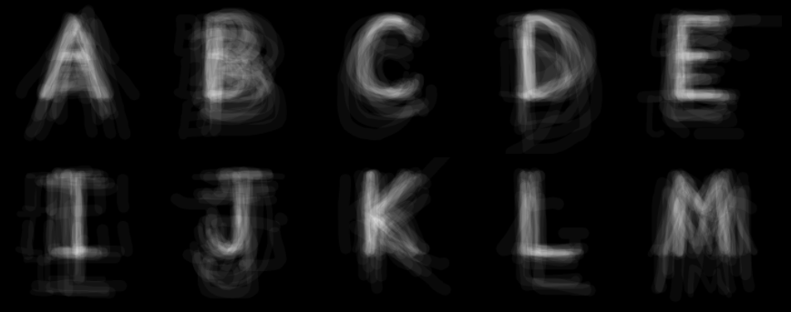

# Crowdfont

See it: https://lisza.github.io/crowdfont. Click anywhere to invert colors.

These letter shapes are the common product of a bunch of people drawing
letters in a box independently from one another with no context.
Not surprising, but also... surprising.

### Background
Every new hire at CrowdFlower Inc. in San Francisco demos a project that
uses their crowdsourcing platform. This ghostly looking alphabet is the
result of about 200 remote micro task contributors freely drawing a
given letter on the screen. The single submissions are processed through
some CrowdFlower magic and overlayed on top of each other. The web page
is for presentation. This was made in 2014.
